<!--
  ╔══════════════════════════════════════════════════════════════╗
  ║  AHMED DGHAIES — profile README                                ║
  ║  Structure: header → snapshot → stats → activity → stack →     ║
  ║             toolbox → projects → connect                       ║
  ╚══════════════════════════════════════════════════════════════╝
-->

<!-- ░░ HERO ░░ -->

  

 

<!-- ░░ DEVELOPER SNAPSHOT ░░ -->

`📍 France` • `💼 Software Engineer @ Wintics` • `⚡ Frontend / Full-stack` • `🧠 Systems & Data-viz`

---

<!-- ░░ GITHUB STATISTICS ░░ -->

### `01` · SIGNALS

<table align="center" style="border-collapse: collapse; border: 0;">
  <tr>
    <td>
      
    </td>
  </tr>
</table>

<table align="center" style="border-collapse: collapse; border: 0;">
  <tr>
    <td></td>
    <td width="12"></td>
    <td></td>
    <td width="12"></td>
    <td></td>
  </tr>
</table>

---

<!-- ░░ CONTRIBUTION ACTIVITY ░░ -->

### `02` · ACTIVITY

<!-- Contribution activity line graph — auto-populated live from GitHub by username -->

  

---

<!-- ░░ STACK ░░ -->

### `03` · STACK

<table width="100%" border="0" cellspacing="0" cellpadding="0" style="border-collapse: collapse; border: 0;">
  <tr>
    <td valign="top" width="33%">
      <h4 align="center">FRONTEND</h4>
      

         
        
      

      
TypeScript · React · Next.js · Vue · Vite · Tailwind

    </td>
    <td valign="top" width="33%">
      <h4 align="center">BACKEND</h4>
      

        
      

      
Python · Django · Node.js · REST

    </td>
    <td valign="top" width="33%">
      <h4 align="center">DATA &amp; DEVOPS</h4>
      

         
        
      

      
MongoDB · MySQL · Docker · Jenkins · Linux · CI/CD

    </td>
  </tr>
</table>

---

<!-- ░░ TOOLBOX ░░ -->

### `04` · THE TOOLBOX

> `~/tools` &nbsp;→&nbsp; the daily drivers

**`VS Code`** · **`GitHub`** · **`Docker`** · **`Postman`** · **`Figma`** · **`Photoshop`** · **`Jenkins`** · **`Linux`**

---

<!-- ░░ PHILOSOPHY ░░ -->
<!-- ░░ PROJECTS ░░ -->

### `05` · SELECTED PUBLIC WORK

| Project                 | What it is                                                       | Stack          | Link                                                        |
| ----------------------- | ---------------------------------------------------------------- | -------------- | ----------------------------------------------------------- |
| `RepoStats`             | Web-based interface to display statistics of GitHub repositories | `Next.js · TS` | [→](https://github.com/Ahmed-Dghaies/RepoStats)             |
| `Finance tracker`       | Web-based application to manage daily finances and goals         | `React · TS`   | [→](https://github.com/Ahmed-Dghaies/finance-tracker)       |
| `React app scaffolding` | A powerful CLI tool to scaffold React 18 projects                | `Next.js · TS` | [→](https://github.com/Ahmed-Dghaies/react-app-scaffolding) |

---

<!-- ░░ CONNECT ░░ -->

### `06` · CONNECT

&nbsp;

  

<code>$ echo "thanks for stopping by" && exit 0</code>

